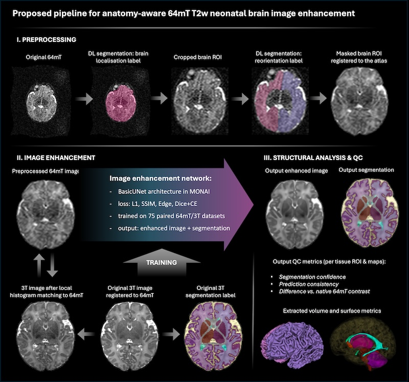

Automated analysis tools for neonatal MRI at 64mT
====================

This repository contains DL pipelines for [MONAI](https://github.com/Project-MONAI/MONAI)-based automated analysis neonatal brain MRI.


- The repository, scripts and models were designed and created at the Department of Early Life Imaging, King's College London.

  
- Please email alena.uus (at) kcl.ac.uk if in case of any questions.


**- IMPORTANT NOTES:**

**- this is a new methods and we would be very grateful for your feedback so that it can be improved! Please email us.**

**- the current version of the pipeline was trained on specific Hyperfine 64mT acquisition protocol (Cawley, 2023) only - it might not work on other acquisitions.**


Development of these processing and analysis tools was supported by projects led by Prof Mary Rutherford, Prof Tomoki Arichi, Prof 
Jonathan O'Muircheartaigh, Prof David Edwards and Prof Jo Hajnal.





Auto processing scripts 
------------------------


**The automated docker tags are _fetalsvrtk/svrtk:neonatal_low_field_mri_analysis_amd_ (AMD system) _fetalsvrtk/svrtk:neonatal_low_field_mri_analysis_amd_ (ARM system)**


**ANATOMY-AWARE T2w CONTRAST ENHANCEMENT FOR 64mT NEONATAL BRAIN MRI:**

*Input data requirements:*
- sufficient image quality, no extreme artifacts / signal loss
- T2w 64mT acquisition protocol (Cawley, 2023)
- full ROI coverage
- standard radiological space
- 25-50 weeks scan PMA
- no extreme structural anomalies (the network was not trained on too many abnormal cases)

*Outputs:*
- enhanced 64mT image reoriented to standard space
- original 64mT image reoriented to standard space
- tissue parcellation label reoriented to standard space
- folder with generated surfaces, measurements and QC metrics

- **!!! the output resolution 1.0mm**
  
Note: you will need >16GB GPU for -gpu option


**PLEASE RUN IT DIRECTLY VIA OUR DOCKER:**

_Note: for MAC - please use docker pull fetalsvrtk/svrtk:perinatal_brain_mri_analysis_arm and CPU version _


```bash

docker pull fetalsvrtk/svrtk:perinatal_brain_mri_analysis_amd

# contrast enhancement + segmentation / surface extraction: CPU version 
docker run --rm --mount type=bind,source=LOCATION_ON_YOUR_MACHINE,target=/home/data  fetalsvrtk/svrtk:perinatal_brain_mri_analysis_amd sh -c ' bash /home/neonatal-low-field-mri-analysis/scripts/run-64mt-enhancement-t2w-neo-brain-cpu.sh [/home/data/path_to_input_t2w_64mt_image.nii.gz] [/home/data/path_to_output_processing_folder] [/home/data/path_to_output_reo_enhanced_image.nii.gz] [/home/data/path_to_output_reo_original_image.nii.gz]  [/home/data/path_to_output_reo_tissue_label.nii.gz]  ; '

# contrast enhancement + segmentation / surface extraction: GPU version 
docker run --rm --gpus all --mount type=bind,source=LOCATION_ON_YOUR_MACHINE,target=/home/data  fetalsvrtk/svrtk:perinatal_brain_mri_analysis_amd sh -c ' bash /home/neonatal-low-field-mri-analysis/scripts/run-64mt-enhancement-t2w-neo-brain-gpu.sh [/home/data/path_to_input_t2w_64mt_image.nii.gz] [/home/data/path_to_output_processing_folder] [/home/data/path_to_output_reo_enhanced_image.nii.gz] [/home/data/path_to_output_reo_original_image.nii.gz]  [/home/data/path_to_output_reo_tissue_label.nii.gz]  ; '


```


**PROCESSING EXAMPLE:**

```bash

docker run --rm --gpus all --mount type=bind,source=/home/au18/folder_with_datasets,target=/home/data  fetalsvrtk/svrtk:perinatal_brain_mri_analysis_amd sh -c ' bash /home/neonatal-low-field-mri-analysis/scripts/run-64mt-enhancement-t2w-neo-brain-cpu.sh /home/data/input-t2w-64mt.nii.gz  /home/data/proc-outputs /home/data/output-reo-enhanced.nii.gz  /home/data/output-reo-orignal.nii.gz  /home/data/output-reo-lab.nii.gz   ; '

```


License
-------

The code and model weights are distributed under the terms of the
[GNU General Public License v3.0](https://www.gnu.org/licenses/gpl-3.0.en.html). This program is free software: you can redistribute it and/or modify it under the terms of the GNU General Public License as published by the Free Software Foundation version 3 of the License. 

This software is distributed in the hope that it will be useful, but WITHOUT ANY WARRANTY; without even the implied warranty of MERCHANTABILITY or FITNESS FOR A PARTICULAR PURPOSE.  See the GNU General Public License for more details.


Citation and acknowledgements
-----------------------------

In case you found this repository useful please give appropriate credit to the software.


**64mT contrast enhancement (will be updated soon):**
> Cawley, P., Uus, A., Colford, K., Padormo, F., Teixeira, R., Tomazinho, I., David Edwards, A., Arichi, T., Hajnal, J. v, & Rutherford, M. A. (2026). Anatomy-aware enhancement of 64 mT T2-weighted neonatal brain MRI for structural analysis Neonatal MRI, ultra low field MRI, contrast transfer. medRxiv, 2026.0*****. https://doi.org/*****

**64mT acquisition protocol:**
> Cawley, P., Padormo, F., Cromb, D., Almalbis, J., Marenzana, M., Teixeira, R., Deoni, S. C., Ljungberg, E., Bennallick, C., Kolind, S., Dean, D., Pepper, M. S., Sekoli, L., de Canha, A., van Rensburg, J., Jones, D. K., Bourke, N., Sabir, H., Lecurieux Lafayette, S., … Edwards, A. D. (2023). Development of neonatal-specific sequences for portable ultralow field magnetic resonance brain imaging: a prospective, single-centre, cohort study. eClinicalMedicine, 65. https://doi.org/10.1016/j.eclinm.2023.102253


Disclaimer
-------

This software has been developed for research purposes only, and hence should not be used as a diagnostic tool. In no event shall the authors or distributors be liable to any direct, indirect, special, incidental, or consequential damages arising of the use of this software, its documentation, or any derivatives thereof, even if the authors have been advised of the possibility of such damage.

